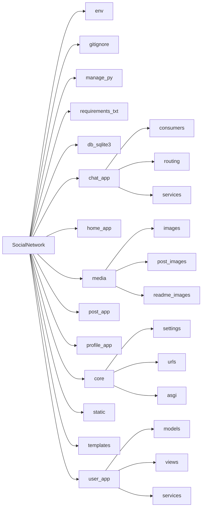

<h1>Social Network</h1>


---

<a name="articles"><h3>Table of contents</h3></a>

# Project Description
<h5>Опис проєкту</h5>

[Project description](#headers)

# Information about our team
<h5>Інформація про команду</h5>

[Information about our team](#team)

# Our project structure
<h5>Структура проєкту</h5>

[structure of project](#structure)

# Getting Started
<h5>Як запустити проєкт</h5>

[Getting started](#getting_started)

# Modules Description
<h5>Опис модулей</h5>

[Modules description](#modules)

# Package Description
-   [Package description](#package_description)
    - [describe Social_network (core) package](#core)
    - [describe user_app package](#user_app)
    - [describe profile_app package](#profile_app)
    - [describe post_app package](#post_app)
    - [describe home_app package](#home_app)
    - [describe chat_app package](#chat_app)
    - [describe media package](#media)
    - [describe static package](#static)
    - [describe templates package](#templates)

# Problems when creating a project
[Problems during development](#prbl_project)

# Conclusion
[Conclusion](#conclusions)

---

<a name="headers"><h1>Project description</h1></a>

Цей проєкт розроблено для ознайомлення із роботою сучасного веб-додатку, принципом отримання та обробки даних від сервера, а також організацією даних у реальному проєкті.

Він корисний для початківця, бо показує, як працюють ключові аспекти побудови соціальної мережі в [Django](https://docs.djangoproject.com/en/6.0/):
- робота з сервером Django та управління моделями, запитами й формами;
- авторизація, реєстрація та управління профілями користувачів;
- обробка даних з бази даних і логіка збереження інформації про пости, коментарі та підписки;
- застосування [WebSocket](https://developer.mozilla.org/en-US/docs/Web/API/WebSockets_API) через [Django Channels](https://channels.readthedocs.io/en/latest/) для реального чату та повідомлень;
- передача повідомлень та чатів у форматі [JSON](https://developer.mozilla.org/en-US/docs/Web/JavaScript/Reference/Global_Objects/JSON), обробка повідомлень на клієнті та сервері;
- завантаження, збереження та відображення медіафайлів (зображення для постів і повідомлень);
- побудова інтерфейсу з шаблонами, маршрутизацією та сучасним UX.

Цей проєкт допоможе розібратися у таких темах:
- як налаштовується взаємодія клієнта і сервера у Django;
- як працюють асинхронні повідомлення та миттєве оновлення контенту в чатах;
- як структурувати дані для соціальної мережі та обробляти їх у backend;
- як реалізувати систему друзів, приватних та групових чатів;
- як зберігати медіафайли й організовувати доступ до них.

<details>
<summary>English version</summary>

This project is designed to introduce you to the workings of a modern web application, the principle of receiving and processing data from the server, as well as the organization of data in a real project.

It's useful for a beginner because it shows how the key aspects of building a social network in [Django](https://docs.djangoproject.com/en/6.0/) work:
- working with the Django server and managing models, requests and forms;
- authorization, registration and management of user profiles;
- data processing from the database and the logic of saving information about posts, comments and subscriptions;
- use of [WebSocket](https://developer.mozilla.org/en-US/docs/Web/API/WebSockets_API) through [Django Channels](https://channels.readthedocs.io/en/latest/) for real chat and messages;
- transmission of messages and chats in [JSON](https://developer.mozilla.org/en-US/docs/Web/JavaScript/Reference/Global_Objects/JSON) format, processing of messages on the client and server;
- downloading, saving and displaying media files (images for posts and messages);
- building an interface with templates, routing and modern UX.

This project will help you understand:
- how client and server interaction is configured in Django;
- how asynchronous messages and instant content updates in chats work;
- how to structure data for the social network and process it in the backend;
- how to implement a system of friends, private and group chats;
- how to store media files and organize access to them.

</details>

[⬆️Table of contents](#articles)

<a name="team"><h1>Information about our team</h1></a>

1. GitHub - [Volodymyr Hrinchenko - Developer](https://github.com/Pranichek)
2. GitHub - [Maksym Selifanov - Developer](https://github.com/MaksymmS)
3. GitHub - [Volodymyr Yakovets - Developer](https://github.com/VolodymyrYakovets2)
4. GitHub - [Valentin Portyanko - Developer](https://github.com/Valentin5944)
5. GitHub - [Vadim Kobzar - Developer](https://github.com/Vadim-Kobzar2010)

[⬆️Table of contents](#articles)

<a name="structure"><h1>Structure of project</h1></a>



[⬆️Table of contents](#articles)

<a name="getting_started"><h1>Getting started</h1></a>

Нижче наведена інструкція, як запустити сайт.

## Installing python

Якщо ви ніколи не встановлювали Python:
- Завантажте інсталятор Python
  - Перейдіть на офіційний [Python website](https://www.python.org)
  - Перейдіть до розділу "Завантаження". Сайт автоматично визначає вашу операційну систему та відображає відповідну версію.
- Виберіть правильну версію
  - Для більшості користувачів рекомендується остання стабільна версія.
- Завантажте інсталятор
  - Натисніть кнопку Завантажити Python у верхньому правому куті екрана.
- Налаштуйте параметри встановлення
  - Поставте прапорець «Додати Python до PATH» у нижній частині вікна інсталятора. Цей крок є ключовим для запуску Python з командного рядка.
- Встановіть Python
  - Натисніть кнопку «Встановити зараз» і дочекайтеся завершення встановлення.
- Перевірте інсталяцію
  - Після встановлення відкрийте термінал або командний рядок.
    <details>
    <summary>Operating system</summary>
    - On Windows: Press Win + R, type cmd, and press Enter.
    - On macOS/Linux: Open the Terminal application.
    </details>
  - Введіть `python --version` або `python3 --version` та натисніть Enter.
- Якщо Python встановлено правильно, ви побачите встановлену версію.

Якщо ви все ще не розумієте, як встановити Python, можете подивитися [тут](https://www.youtube.com/watch?v=uge4A1LHsNk)

[⬆️Table of contents](#articles)

## Installing this project

1. Клонуйте проєкт
   - Перейдіть на головну сторінку проєкту на GitHub.
   - Натисніть зелену кнопку «Code», розташовану вгорі праворуч.
   - Виберіть параметр HTTPS і скопіюйте URL-адресу проєкту.
2. Відкрийте проєкт у IDE
   - Запустіть бажану IDE (VS Code, PyCharm або іншу).
   - Натисніть Control + J або просто створіть новий термінал і напишіть:
     ```
     git clone https://github.com/Pranichek/Social-Network.git
     ```
3. Підготуйте проєкт до використання
   ```
   cd Social-Network
   ```
4. Створіть віртуальне середовище

   Для macOS/Linux:
   ```
   python3 -m venv venv
   ```
   Для Windows:
   ```
   python -m venv venv
   ```
5. Активуйте віртуальне середовище

   На macOS/Linux:
   ```
   source venv/bin/activate
   ```
   На Windows:
   ```
   venv\Scripts\activate
   ```
6. Встановіть модулі проєкту
   ```
   pip install -r requirements.txt
   ```
7. Запуск програми
   ```
   cd Social_network
   python manage.py runserver
   ```

<details>
<summary>English version</summary>

### Installing Python

If you've never installed Python before:
- Download the Python installer
  - Go to the official [Python website](https://www.python.org)
  - Go to the "Downloads" section — the site detects your OS automatically.
- Choose the right version
  - The latest stable version is recommended for most users.
- Run the installer
  - Click the Download Python button in the top right corner.
- Configure installation settings
  - Check the "Add Python to PATH" box at the bottom of the installer window. This step is key to running Python from the command line.
- Install Python
  - Click "Install Now" and wait for the installation to finish.
- Verify the installation
  - After installation, open a terminal or command prompt.
    <details>
    <summary>Operating system</summary>
    - On Windows: Press Win + R, type cmd, and press Enter.
    - On macOS/Linux: Open the Terminal application.
    </details>
  - Type `python --version` or `python3 --version` and press Enter.
- If Python is installed correctly, you will see the installed version.

If you still don't understand how to install Python, you can watch [this video](https://www.youtube.com/watch?v=uge4A1LHsNk)

### Installing this project

1. Clone the project
   - Go to the project's main page on GitHub.
   - Click the green "Code" button in the top right corner.
   - Select the HTTPS option and copy the project's URL.
2. Open the project in an IDE
   - Launch your preferred IDE (VS Code, PyCharm, etc.).
   - Press Control + J or create a new terminal and type:
     ```
     git clone https://github.com/Pranichek/Social-Network.git
     ```
3. Prepare the project
   ```
   cd Social-Network
   ```
4. Create a virtual environment

   For macOS/Linux:
   ```
   python3 -m venv venv
   ```
   For Windows:
   ```
   python -m venv venv
   ```
5. Activate the virtual environment

   On macOS/Linux:
   ```
   source venv/bin/activate
   ```
   On Windows:
   ```
   venv\Scripts\activate
   ```
6. Install the project's modules
   ```
   pip install -r requirements.txt
   ```
7. Run the application
   ```
   cd Social_network
   python manage.py runserver
   ```

</details>

[⬆️Table of contents](#articles)

<a name="modules"><h1>MODULES FOR PROGRAM</h1></a>

### MODULES FOR DOWNLOADING

* **Django** — головний високорівневий веб-фреймворк на Python. Забезпечує роботу ORM бази даних, маршрутизацію URL, обробку запитів (Views) та рендеринг HTML-шаблонів.

* **channels** — інтегрує підтримку асинхронних протоколів у Django, дозволяє створювати `Consumers` для WebSocket-з'єднань.

* **daphne** — асинхронний ASGI-сервер, який запускає проєкт замість стандартного WSGI, щоб підтримувати HTTP та WebSockets одночасно.

* **Pillow** — робота із зображеннями (відкривати, редагувати, зберігати). Потрібна Django для валідації та збереження файлів у полях `ImageField` (аватари, медіа в постах).

* **asgiref** — набір інструментів для взаємодії між асинхронним (async) та синхронним (sync) кодом у Python. Використовується для виклику ORM-запитів у сокетах.

### BASE MODULES

* **os** — модуль, який використовується для побудови шляхів до файлів, роботи з директоріями (наприклад, для збереження медіафайлів).

* **json** — вбудований модуль Python для серіалізації/десеріалізації даних, що передаються через WebSocket.

<details>
<summary>English version</summary>

### MODULES FOR DOWNLOADING

* **Django** — the main high-level Python web framework. Provides the database ORM, URL routing, request handling (Views), and HTML template rendering.

* **channels** — adds async protocol support to Django, enables WebSocket `Consumers`.

* **daphne** — an ASGI-compatible server that runs the project instead of standard WSGI to support both HTTP and WebSockets simultaneously.

* **Pillow** — image processing (open, edit, save). Required by Django to validate and save files in `ImageField` fields (avatars, post media).

* **asgiref** — a set of tools for async/sync interoperability in Python. Used to call ORM queries inside sockets.

### BASE MODULES

* **os** — used for building file paths and working with directories (e.g. for storing media files).

* **json** — a built-in Python module for serializing/deserializing data sent over WebSocket.

</details>

[⬆️Table of contents](#articles)

<a name="core"><h1>Social_network (core)</h1></a>

Кореневий пакет застосунку. Тут створюється головний екземпляр проєкту, налаштовуються параметри роботи через `settings.py`, реєструються маршрути (`urls.py`) та конфігурується ASGI-сервер (`asgi.py`), що дозволяє одночасно обробляти звичайні HTTP-запити та довготривалі WebSocket-з'єднання.

[link to file](https://github.com/Pranichek/Social-Network/tree/main/Social_network)

```python
    # asgi.py — точка входу для ASGI-сервера (Daphne),
    # яка дозволяє обробляти HTTP і WebSocket в одному застосунку

    application = ProtocolTypeRouter({
        "http": django_asgi_app,
        "websocket": AuthMiddlewareStack(
            URLRouter(chat_app.routing.websocket_urlpatterns)
        ),
    })
```

<details>
<summary>English version</summary>
The root application package. This is where the main project instance is created, operating parameters are configured via `settings.py`, routes are registered (`urls.py`), and the ASGI server is configured (`asgi.py`), allowing both regular HTTP requests and long-lived WebSocket connections to be handled simultaneously.
</details>

[⬆️Table of contents](#articles)

<a name="user_app"><h1>user_app</h1></a>

Модуль відповідає за користувачів і автентифікацію: кастомну модель користувача (замінює стандартну Django-модель), реєстрацію з AJAX-валідацією, вхід без перезавантаження сторінки, керування сесіями та підтвердження email через код. Власний шар `services/` обробляє логіку соціальних зв'язків (друзі/підписки) та генерацію токенів підтвердження.

<!-- TODO: додати gif реєстрації/входу, наприклад:
 -->

[link to file](https://github.com/Pranichek/Social-Network/tree/main/user_app)

```python
    # views.py (приклад)
    def register_user(request):
        '''
        Обробка AJAX-реєстрації: перевірка унікальності email,
        створення коду підтвердження та надсилання його на пошту
        '''
        # TODO: вставити реальний код функції
        pass
```

<details>
<summary>English version</summary>
This module handles users and authentication: a custom user model, AJAX-validated registration, login without a page reload, session management, and email confirmation codes. A dedicated `services/` layer processes the social graph logic (friends/subscriptions) and confirmation token generation.
</details>

[⬆️Table of contents](#articles)

<a name="profile_app"><h1>profile_app</h1></a>

Модуль керує персональною сторінкою користувача: відображенням основної інформації, налаштуваннями профілю (`settings.html`) та списком друзів.

<!-- TODO: додати gif редагування профілю -->

[link to file](https://github.com/Pranichek/Social-Network/tree/main/profile_app)

```python
    # views.py (приклад)
    def render_profile(request, user_id):
        '''Рендер персональної сторінки користувача та списку друзів'''
        # TODO: вставити реальний код функції
        pass
```

<details>
<summary>English version</summary>
This module manages the user's personal page: displaying core information, profile settings (`settings.html`), and the friends list.
</details>

[⬆️Table of contents](#articles)

<a name="post_app"><h1>post_app</h1></a>

Модуль відповідає за публікації — створення постів, обробку тегів і загальну взаємодію користувача з контентом.

<!-- TODO: додати gif створення поста -->

[link to file](https://github.com/Pranichek/Social-Network/tree/main/post_app)

```python
    # views.py (приклад)
    def create_post(request):
        '''Обробка створення нового поста: текст, теги, медіафайли'''
        # TODO: вставити реальний код функції
        pass
```

<details>
<summary>English version</summary>
This module is responsible for publications — post creation, tag processing, and general content interaction.
</details>

[⬆️Table of contents](#articles)

<a name="home_app"><h1>home_app</h1></a>

Модуль реалізує головну стрічку (фід) із динамічним підвантаженням нових публікацій через AJAX (`post_load.js`) без перезавантаження сторінки.

<!-- TODO: додати gif стрічки -->

[link to file](https://github.com/Pranichek/Social-Network/tree/main/home_app)

```python
    # views.py (приклад)
    def load_more_posts(request):
        '''AJAX-ендпоінт для підвантаження наступної порції постів стрічки'''
        # TODO: вставити реальний код функції
        pass
```

<details>
<summary>English version</summary>
This module implements the home feed with dynamic loading of new posts via AJAX (`post_load.js`) without a page reload.
</details>

[⬆️Table of contents](#articles)

<a name="chat_app"><h1>chat_app</h1></a>

Модуль реалізує месенджер у реальному часі. `consumers.py` містить асинхронні WebSocket-консюмери, які приймають і надсилають повідомлення без перезавантаження сторінки; `routing.py` відповідає за маршрутизацію сокет-з'єднань. Окремий шар `services/` реалізує кастомну пагінацію для списків чатів, груп та повідомлень.

<!-- TODO: додати gif чату -->

[link to file](https://github.com/Pranichek/Social-Network/tree/main/chat_app)

```python
    # consumers.py (приклад)
    class ChatConsumer(AsyncWebsocketConsumer):
        '''Асинхронний консюмер для обміну повідомленнями в реальному часі'''
        async def receive(self, text_data):
            data = json.loads(text_data)
            # TODO: вставити реальну логіку збереження та розсилки повідомлення
```

<details>
<summary>English version</summary>
This module implements the real-time messenger. `consumers.py` contains asynchronous WebSocket consumers that send and receive messages without reloading the page; `routing.py` handles socket connection routing. A separate `services/` layer implements custom pagination for chat lists, groups, and messages.
</details>

[⬆️Table of contents](#articles)

<a name="media"><h1>media</h1></a>

Директорія для збереження завантажених користувачами файлів — аватарів та зображень, прикріплених до постів і повідомлень.

[link to file](https://github.com/Pranichek/Social-Network/tree/main/media)

<details>
<summary>English version</summary>
Directory for storing user-uploaded files — avatars and images attached to posts and messages.
</details>

[⬆️Table of contents](#articles)

<a name="static"><h1>static</h1></a>

Статичні ресурси інтерфейсу — CSS, JS-скрипти та зображення, які не змінюються динамічно.

[link to file](https://github.com/Pranichek/Social-Network/tree/main/static)

<details>
<summary>English version</summary>
Static interface assets — CSS, JS scripts, and images that don't change dynamically.
</details>

[⬆️Table of contents](#articles)

<a name="templates"><h1>templates</h1></a>

HTML-шаблони, які використовуються Django для рендерингу сторінок усіх застосунків проєкту.

[link to file](https://github.com/Pranichek/Social-Network/tree/main/templates)

<details>
<summary>English version</summary>
HTML templates used by Django to render pages for all applications in the project.
</details>

[⬆️Table of contents](#articles)

<a name="prbl_project"><h2>Problems during development</h2></a>

<!-- TODO: команда, замініть цей розділ на реальні труднощі, з якими ви зіткнулись -->

Перша проблема, яка виникла, — це нестикування графіка роботи з співкомандниками, але ця проблема дуже швидко вирішилась, коли всі надали свої графіки занять.
Друга проблема в тому, що подібний проєкт ми робимо вперше, тому виникали своєрідні невеликі труднощі та питання.
У деяких моментах ми могли що-небудь забути або не знати, і доводилось шукати й гуглити інформацію по проєкту, а також пробувати купу різних варіантів, щоб виправити ту чи іншу помилку.
Ще одна проблема виникла, коли хтось міг щось не записати в конспект на уроці або пропустити минулу зустріч, і доводилось вводити людину в курс справи.

<details>
<summary>English version</summary>

The first problem that arose was a scheduling conflict with my teammates, but this issue was resolved very quickly once everyone shared their class schedules.
The second problem was that we are doing this kind of project for the first time, so we faced some minor difficulties and questions.
At certain points, we could forget or not know something, so we had to search and google information about the project, as well as try a bunch of different options to fix a particular error.
Another problem arose when someone might have missed something in their class notes or missed the previous meeting, so we had to bring them up to speed.
</details>

[⬆️Table of contents](#articles)

<a name="conclusions"><h2>Conclusion</h2></a>

<!-- TODO: команда, замініть цей розділ на власні висновки -->
Це був наш перший подібний проект що дав нам очевидний досвід. Ми працювали з Django JS CSS HTML і т.д. що дало нам явне уявлення як з цим працювати та реалізовувати.
Вперше ми зіткнулися і попрацювали з WebSocket та AJAX для того, щоб реальзувати спілкування в реальному часі та роботу веб-сторінки у фоновому режимі.


<details>
<summary>English version</summary>

Working on this project gave the team hands-on experience building a modern real-time Django web application. We learned to work with a custom user model and authentication system, implement messaging via WebSockets and Django Channels, structure data for a social network (posts, profiles, chats, friends), and split the project into separate modules for easier maintenance and scalability.

Going forward, the project could be extended with real-time notifications, group chats with advanced permissions, a recommendation feed, and automated test coverage.

</details>

[⬆️Table of contents](#articles)


